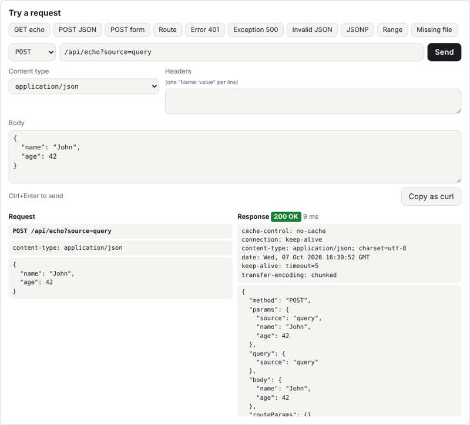

DEV WEB SERVER
==============
[](https://github.com/manufitoussi/dev-web-server/actions/workflows/ci.yml)
[](https://www.npmjs.com/package/dev-web-server)
[](LICENSE)

A simple web & API server for your development.
-----------------------------------------------

> **Version 3.0** requires Node.js 22 and changes the endpoint parameters: see the [changelog](CHANGELOG.md) and the [upgrade guide](docs/upgrade-3.md).

# Definition
This project is a [NodeJS] application that creates a local web server simply and quickly. It serves static files and dynamic data: it is useful to mock an API or to serve your website project.

# Features
This application creates, by default, a web server on `http://localhost:8080/` that targets the *website root* from the *launching directory*.

You can:
- choose a domain,
- choose a port,
- choose the directory of the *website root*,
- add a delay before each response,
- define a set of API endpoints, with routes like `/users/:id`, reloaded when their file changes,
- choose the root URL of the API endpoints,
- activate the SPA mode,
- activate the CORS headers,
- allow browser caching (responses are sent with `Cache-Control: no-cache` by default),
- hide the request logs.

The files are streamed with `Range` support (videos and audio files can be played from any position). A test card shows all of this live: see [Test card](#test-card).

## Default webpage

The default webpage at the *website root* is `index.html`. A request to a directory (e.g. `/docs/` or `/docs`) serves its `index.html` file.

File names with special characters are supported: the requested URL is decoded (e.g. `/my%20file.txt` serves `my file.txt`). Files outside of the *website root* are never served.

## Favicon

The web server supports using `favicon.ico`. It has to be located at the site root.

## Endpoint verbs

The endpoints accept all the HTTP verbs: the endpoint function gets the request and chooses its response.

## SPA mode

In SPA mode, the requests of missing files are answered with your base file (default: `index.html`, see `root` in the configuration file). This is useful for single page applications without a hash-based routing system.

## Content types

The content type of the requested file is resolved with [mime-types]. This tool looks up the content type from the requested file extension, with its charset for the text files (e.g. `text/html; charset=utf-8`). If nothing matches, the default content type is used: `application/octet-stream`.

## Streaming and ranges

The files are streamed: big files are not loaded in memory. The responses have a `Content-Length` header and support the `Range` requests (`bytes=start-end`, `bytes=start-` and `bytes=-length`), so the videos and the audio files can be played from any position. A range outside of the file gives a `416` response, and an unsupported range (e.g. multiple ranges) gives the whole file. A `HEAD` request gives the headers only.

## OPTIONS requests

An `OPTIONS` request on a static file is answered with a `204` status and an `Allow: GET, HEAD, OPTIONS` header (and the CORS headers if `CORS` is active), so the CORS preflight requests succeed.

# Required environment

* A release of [NodeJS] >= `22.0.0` must be installed on your system.

# Installation

## Without installation

Run the latest version with `npx`:

```bash
npx dev-web-server
```

## In a project (recommended)

Add the server as a development dependency, so everyone working on the project uses the same version:

```bash
npm install --save-dev dev-web-server
# or: pnpm add -D dev-web-server
# or: yarn add -D dev-web-server
```

Then add a script to the `package.json` of the project, with your parameters:

```json
{
  "scripts": {
    "serve": "dev-web-server BASEDIR ./public ENDPOINTS ./mock/endpoints.js"
  }
}
```

and run it with `npm run serve`. The parameters can also be in a `dev-web-server.json` file (see [The JSON Configuration File](#the-json-configuration-file)).

## Globally

```bash
npm install -g dev-web-server
```

The `dev-web-server` command is then available everywhere. Uninstall it with `npm uninstall -g dev-web-server`.

# Usage

## Launch server
To launch the web server with default parameters:

```bash
dev-web-server
```

(or `npx dev-web-server`, or your `package.json` script, see [Installation](#installation)).

With this command, the application creates a web server:
- at the URL `http://localhost:8080/`,
- serving the *website root* from the *launching directory*,
- without any delay,
- without API endpoints.

If the server cannot start (e.g. the port is already in use), an error message is displayed and the application exits with the code `1`.

## The CLI Parameters

| Parameter   | Description      |
|------------ | ---------------- |
| `HELP` (or `--help`, `-h`, `-?`) |  Display the help |
| `DOMAIN`    |  Domain of the server (default: `localhost`) |
| `PORT`      |  Port of the server (default: `8080`) |
| `BASEDIR`   |  *relative* or *absolute* path to the *website root* (default: *launching directory*) |
| `DELAY`     |  Time delay in milliseconds before each server response (default: `0` ms) |
| `ENDPOINTS` |  *relative* or *absolute* path to the file that contains API endpoints *(see definition below)*, reloaded when it changes |
| `ENDPOINTSROOT` |  Root URL for routing API endpoints (default: `/api`) |
| `SPA`       |  Activate the SPA mode (default: `false`) |
| `CORS`      |  Activate the CORS headers in responses |
| `QUIET`     |  No request logs: only the server errors (`5xx` responses, endpoints file loading) are displayed |
| `CACHE`     |  Allow browser caching: without it, responses are sent with a `Cache-Control: no-cache` header |

`PORT` has to be an integer between `0` and `65535`, and `DELAY` a positive integer or `0`. If a parameter value is missing or invalid, an error message is displayed and the application exits with the code `1`.

## Examples

```bash
dev-web-server DOMAIN 0.0.0.0 PORT 1234 BASEDIR ../rep/httpdocs DELAY 2000 ENDPOINTS ../rep/server/my-endpoints.js ENDPOINTSROOT /my-api
```

This command launches a web server:
- listening on all network interfaces (`0.0.0.0`) on port `1234`, e.g. at the URL `http://localhost:1234/`,
- serving the *website root* from the directory `../rep/httpdocs/`,
- with a delay of `2000` ms before each response,
- with API endpoints defined in the file `../rep/server/my-endpoints.js`, at the root URL `/my-api`.

## The JSON Configuration File

You can use a JSON configuration file in the launching directory: `dev-web-server.json`.
Any argument in the command line will override the corresponding one in this file.
The values are validated like the command line arguments: an invalid value, or a file that is not valid JSON, stops the application with an error message.

The JSON configuration file can contain the following properties:

| Property | Type | Description | Default value |
| --- | --- | --- | --- |
| domain | `string` | Domain name of the server | `localhost` |
| port | `number` | Port number of the server | `8080` |
| baseDir | `string` | *relative* or *absolute* path to the *website root* | *launching directory* |
| delay | `number` | Time delay in milliseconds before each server response | `0` |
| endPointsFilePath | `string` | *relative* or *absolute* path to the file that contains API endpoints *(see definition below)* | `null` |
| endPointsRoot | `string` | Root URL for routing API endpoints | `/api` |
| root | `string` | Base file of the website, served for `/`; its name is the index file of the directories, and it answers the missing files in SPA mode | `/index.html` |
| isSPA | `boolean` | Activate SPA mode | `false` |
| withCORS | `boolean` | Activate CORS headers in responses | `false` |
| isQuiet | `boolean` | No request logs: only the server errors are displayed | `false` |
| withCache | `boolean` | Allow browser caching (if `false`, responses are sent with a `Cache-Control: no-cache` header) | `false` |

Example:

```JSON
{
  "domain": "0.0.0.0",
  "port": 13002,
  "baseDir": "./dist/test-pages",
  "delay": 0,
  "endPointsFilePath": "./api-proxy/api.js",
  "withCORS": true
}
```

## Definition of the API endpoints file

The API endpoints can be defined in a [NodeJS] script file. It has to export a `JavaScript` object. Each of its properties declares an endpoint: the key is the URL path after the endpoints root URL (default: `/api`), and the value is the `function` to execute.

A key can be a route with parameters, starting with `:`: the key `/users/:id` matches `/users/42`, and the endpoint gets `req.params.id` = `'42'` (decoded). An endpoint with the exact key wins over the routes (`/users/me` over `/users/:id`), and if several routes match, the one with the most static segments wins (`/users/:id/posts` over `/:kind/:id/posts`), then the first declared.

The endpoints file is watched: when it changes, the server reloads it without restarting. If the new version cannot be loaded (e.g. a syntax error), the error is displayed and the previous endpoints are kept. The state of the file (its variables) is reset by a reload, and the modules imported by the endpoints file are not reloaded.

The file can be an ES module (`export default { ... }`) or a CommonJS module (`module.exports = { ... }`). Its format is chosen by [NodeJS] as usual: the `.mjs` and `.cjs` extensions, or the `type` field of the nearest `package.json` for a `.js` file.

### Endpoint function

The endpoint function sends the response. It takes the following arguments:

| Argument | Type | Description |
| --- | --- | --- |
| req | `Request` | [NodeJS] request object |
| res | `Response` | [NodeJS] response object |
| params | `Object` | All the parameters of the request: the `query string` parameters, the `body` fields (JSON or url encoded form object) and the route parameters, the last ones winning |
| sendSuccess | `Function` | Callback function to call to send a successful response |
| sendError | `Function` | Callback function to call to send a failed response |

If the endpoint function throws an exception, the server responds with a `500` error and keeps running.

The parameters are also available separately on the request object:

| Property | Type | Description |
| --- | --- | --- |
| req.query | `Object` | The `query string` parameters (a repeated key gives an array of values) |
| req.body | any | The request body: the parsed value for a JSON body (`application/json` or `*+json`), an object for a url encoded form (`application/x-www-form-urlencoded`), the raw string otherwise, `undefined` if empty |
| req.params | `Object` | The route parameters |

An invalid JSON body gives a `400` JSON error, without calling the endpoint.

Example: `POST /api/users?notify=true` with the JSON body `{"name":"John"}` gives `params` = `{ notify: 'true', name: 'John' }`.

#### Successful callback

The `sendSuccess` callback sends a successful response with the result object of the request. It takes the following arguments:

| Argument | Type | Description |
| --- | --- | --- |
| req | `Request` | [NodeJS] request object |
| res | `Response` | [NodeJS] response object |
| result | `Object` | Result object of the request |
| jsonpCallback | `string` | **[optional]** JSONP callback function name to activate JSONP response |

A JSONP response is sent with the `application/javascript` content type. The callback name has to be a JavaScript identifier or a dotted path of identifiers (e.g. `myCallback` or `app.callbacks.done`): otherwise a `400` JSON error is sent.

#### Failed callback

The `sendError` callback sends an error response. It takes the following arguments:

| Argument | Type | Description |
| --- | --- | --- |
| req | `Request` | [NodeJS] request object |
| res | `Response` | [NodeJS] response object |
| httpCode | `number` | `HTTP` code of the response |
| message | `string` | Error text message |
| result | `Object` | **[optional]** Result object of the request: the `error` property is added to it |
| jsonpCallback | `string` | **[optional]** JSONP callback function name to activate JSONP response |

Example:

```js
var Repository = {
  count:0
};

export default {
  '/example': function (req, res, params, sendSuccess, sendError) {

    // Response result is: '{"test":"coucou","count":0}', then 1, 2...
    // HTTP code is 200
    sendSuccess(req, res, {
      test: 'coucou',
      count: Repository.count++
    });

  },

  '/users/:id': function (req, res, params, sendSuccess, sendError) {

    // GET /api/users/42?fields=name gives req.params = { id: '42' } and params = { fields: 'name', id: '42' }.
    sendSuccess(req, res, { id: req.params.id, fields: params.fields });

  },

  '/users': function (req, res, params, sendSuccess, sendError) {

    // POST /api/users with the JSON body {"name":"John"} gives req.body = { name: 'John' }.
    sendSuccess(req, res, { created: req.body });

  },

  '/exampleJSONP': function (req, res, params, sendSuccess, sendError) {

    // With '?myCallbackName=myCallback', the response result is: myCallback({"test":"coucou","count":<the next count>});
    // HTTP code is 200
    sendSuccess(req, res, {
      test: 'coucou',
      count: Repository.count++
    }, params.myCallbackName);

  },

  '/exampleError': function (req, res, params, sendSuccess, sendError) {

    // Response result is: '{"error":{"code":401,"message":"An error occurred while doing something"}}'.
    // HTTP code is 401
    sendError(req, res, 401, 'An error occurred while doing something');

  }
};

```

The same file as a CommonJS module:

```js
module.exports = {
  '/example': function (req, res, params, sendSuccess, sendError) {
    sendSuccess(req, res, { test: 'coucou' });
  },
};
```

## Stop the server

To stop the server, type `Ctrl+C`.

# Development

## Test card

Run the demo with:

```bash
npm start
```

It serves a test card at `http://localhost:8080/`: the page checks live, from the browser, the features of the server (static files, content types, ranges, endpoints, parameters, errors, JSONP) and shows the active options. Click a check to see its requests and responses, or run it again. The *Try a request* section sends your own requests (method, URL, content type, headers, body), shows the full response, and copies them as `curl` commands; its examples fill it in one click. Its files are in `demo/public/`, and its endpoints in `demo/endpoints.js`. You can add the usual parameters, e.g. `npm start -- CORS DELAY 500`.


The *Try a request* section, after a click on the *POST JSON* example:



## Tests

Run the unit tests:

```bash
npm test
```

The tests run the real command line application and query it over HTTP (see `tests/`). They also run on GitHub Actions with Node.js 22 and 24 for each push and pull request.

The decisions taken on the project are recorded in [docs/decisions.md](docs/decisions.md).

## Releasing

The package is published on npm by GitHub Actions when a GitHub release is published (`.github/workflows/publish.yml`), with the npm trusted publishing: no npm token is needed, and npm shows the provenance of the package.

1. On `develop`: update the `version` of `package.json` and the `CHANGELOG.md`.
2. Merge `develop` into `master` (pull request).
3. Create a GitHub release on `master` with a new tag `v<version>` (e.g. `v3.1.0`) and the changelog of the version.

The workflow runs the tests, checks that the tag matches the version of `package.json`, then publishes the package. A release marked as a pre-release (e.g. `v3.1.0-beta.1`) is published with the npm tag `next` instead of `latest`.

# License

[MIT](LICENSE)

[NodeJS]: http://nodejs.org/
[npm]: https://npmjs.org/
[mime-types]: https://www.npmjs.com/package/mime-types
